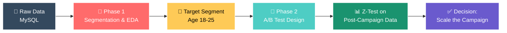
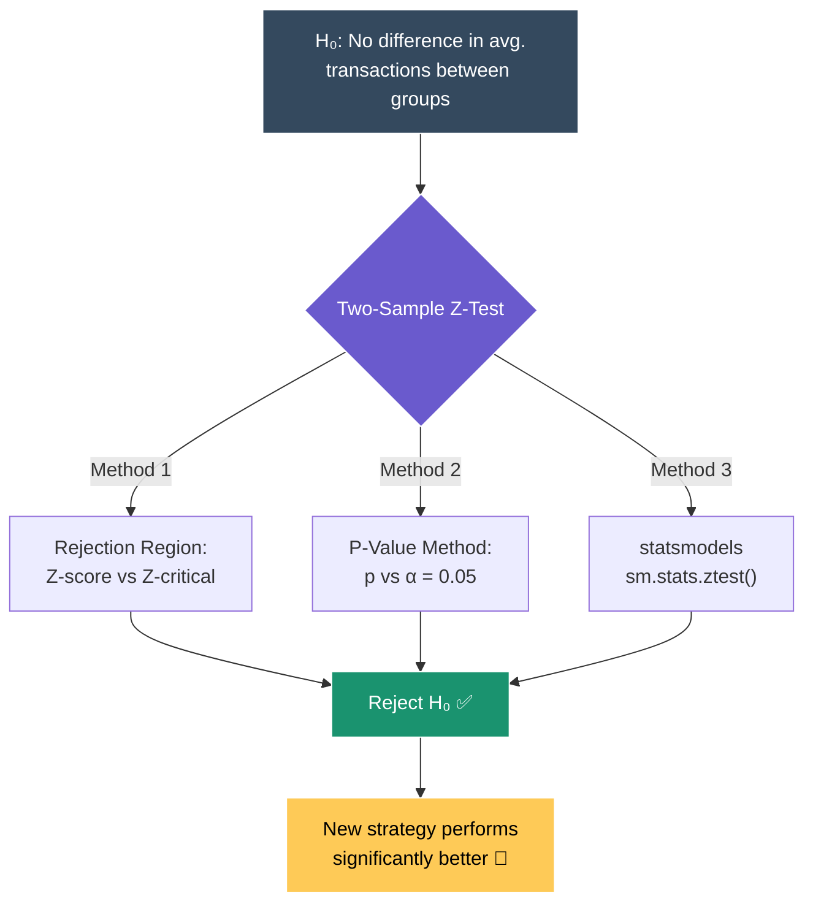

<div align="center">

# 💳 Data-Driven Customer Segmentation for Credit Card Launch

### *Identify high-value customers, run A/B tests, and validate a new credit card strategy with real statistics*


</div>

---

## ✨ Project Overview

A two-phase, end-to-end analytics project for **AtliQ Bank**, built to decide *who* a new credit card should target and *whether* a marketing campaign actually moves the needle.



---

## 📁 Repository Structure

```
Data-Driven-Customer-Segmentation-for-Credit-Card-Launch/
│
├── 📂 phase_1/
│   └── 📂 dataset/
│       ├── customers.csv                      # ~1,000 customer demographic records
│       ├── credit_profiles.csv                # ~1,004 customer credit/risk records
│       └── avg_transactions_after_campaign.csv# Pilot control vs. test transactions
│
├── 📂 phase_2/
│   ├── phase_2.ipynb                          # A/B test design + Z-test analysis
│   ├── analysis.png                           # 18-25 segment behavior chart
│   ├── image.png                              # Supporting visualization
│   └── 📂 data/
│       └── avg_transactions_after_campaign.csv# Full 2-month campaign results
│
├── LICENSE
└── README.md
```

---

## 1️⃣ Phase 1 — Customer Segmentation & EDA
📁 `phase_1/dataset/`

| Dataset | Rows | What's Inside |
|---|---|---|
| 👤 `customers.csv` | ~1,000 | Name, gender, age, location, occupation, annual income, marital status |
| 💰 `credit_profiles.csv` | ~1,004 | Credit score, credit utilisation, outstanding debt, recent credit inquiries, credit limit |
| 📈 `avg_transactions_after_campaign.csv` | 62 days | Control vs. test group average transaction amounts (pilot) |

### 🎯 Objectives
- Pull customer & credit data out of a **MySQL** source
- Clean missing values and process categorical/numerical fields
- Explore age, income, occupation, and spending patterns
- Pinpoint a high-potential **target segment**

### 🧠 Key Findings
> 🌟 **Customers aged 18–25 represent ~25% of the customer base** and show the strongest engagement potential — income and occupation patterns make them the ideal target for the new card launch.

---

## 2️⃣ Phase 2 — A/B Testing & Statistical Validation
📁 `phase_2/phase_2.ipynb`

### ⚙️ Experiment Design

| Step | Detail |
|---|---|
| 🧪 **Power Analysis** | Used `statsmodels.stats.api.tt_ind_solve_power` with `alpha=0.05`, `power=0.8` to size the test |
| 📐 **Effect Sizes Tested** | 0.1 → 1.0, settling on **0.4** as the business-relevant minimum detectable difference |
| 👥 **Sample Selection** | ~246 customers identified in the 18–25 segment → **100 customers** chosen for the pilot |
| 📅 **Campaign Window** | 2 months (**2023-09-10 → 2023-11-10**), daily avg. transactions logged for control & test groups |

### 🔬 Two-Sample Z-Test for Hypothesis Testing



The notebook validates the result **three different ways** and arrives at the same conclusion every time:
1. **Critical Z-value (rejection region)** — computed Z-score exceeds `z_critical`
2. **P-value method** — `p_value < alpha`, so H₀ is rejected
3. **statsmodels API** — `sm.stats.ztest()` confirms the manual calculations

### 🧠 Key Insight
> 📌 The **test group's average transaction amount is significantly higher** than the control group's — the Z-score clears the critical threshold and the p-value falls below 0.05 across all three validation methods.

### 📌 Outcome
- ✅ Null hypothesis rejected → **new credit card strategy works**
- 🚀 Recommendation: **scale the campaign** to the broader 18–25 audience

---

## 🛠️ Tech Stack

<div align="center">


**Libraries:** `pandas` • `numpy` • `matplotlib` • `seaborn` • `scipy.stats` • `statsmodels`

</div>

---

## 🚀 How to Run

```bash
# 1. Clone the repository
git clone https://github.com/rushikreddie/Data-Driven-Customer-Segmentation-for-Credit-Card-Launch.git
cd Data-Driven-Customer-Segmentation-for-Credit-Card-Launch

# 2. Install dependencies
pip install pandas numpy matplotlib seaborn scipy statsmodels jupyter

# 3. Launch the analysis
jupyter notebook phase_2/phase_2.ipynb
```

> 🔐 **Note:** Database credentials and connection details have been removed for security. Phase 1 data is provided directly as CSVs in `phase_1/dataset/`.

---

## 📈 Skills Demonstrated

✅ End-to-end data pipeline (extraction → cleaning → EDA → testing)
✅ Customer segmentation using demographic & credit data
✅ Statistical power analysis & sample size calculation
✅ Two-sample Z-test (rejection region, p-value, and library-based)
✅ Data visualization & business storytelling
✅ Actionable, data-backed business recommendations

---

## 🚀 Future Improvements

- 📊 Interactive dashboard (Streamlit)
- 🤖 ML-based segmentation (clustering)
- ☁️ Deployment for real-time campaign monitoring

---

## 👨‍💻 Author

**Rushik Reddy** — passionate about Data Science, AI & Business Analytics, skilled in Python, SQL, and statistical analysis.

---

<div align="center">

### ⭐ If you found this project useful, consider giving it a star!


</div>
